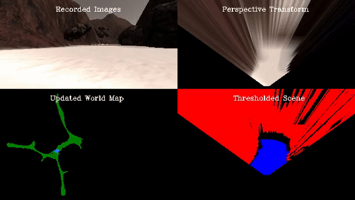

# Project: Search and Sample Return

---
[//]: # (Image References)

[pr_image1]: ./misc/pr_image1.png
[pr_image0]: ./misc/pr_image0.png
[pr_image2]: ./misc/pr_image2.png
[pr_image3]: ./misc/pr_image3.png
[nav_image0]: ./misc/nav_image.png
[pr_video]: .output/mydata_mapping_final


## Introduction

The objective of this project was to enable a rover to navigate autonmously in an unknown environment by developing its ability perceive and decide.

![alt text][nav_image0]

The goals / steps of this project are the following:  

**Training / Calibration**  

* Download the simulator and take data in "Training Mode"
* Test out the functions in the Jupyter Notebook provided
* Add functions to detect obstacles and samples of interest (golden rocks)
* Fill in the `process_image()` function with the appropriate image processing steps (perspective transform, color threshold etc.) to get from raw images to a map.  The `output_image` you create in this step should demonstrate that your mapping pipeline works.
* Use `moviepy` to process the images in your saved dataset with the `process_image()` function.  Include the video you produce as part of your submission.

**Autonomous Navigation / Mapping**

* Fill in the `perception_step()` function within the `perception.py` script with the appropriate image processing functions to create a map and update `Rover()` data (similar to what you did with `process_image()` in the notebook). 
* Fill in the `decision_step()` function within the `decision.py` script with conditional statements that take into consideration the outputs of the `perception_step()` in deciding how to issue throttle, brake and steering commands. 
* Iterate on your perception and decision function until your rover does a reasonable (need to define metric) job of navigating and mapping.  


---
## Training / Calibration (Notebook Analysis)
#### PART I. Run the functions provided in the notebook on test images (first with the test data provided, next on data you have recorded). Add/modify functions to allow for color selection of obstacles and rock samples.

After recording a series of images with the rover in "training" mode, an image processing pipeline was designed. The purpose of this pipeline was to extract useful information from the robot's sensors to guide it during autonomous navigation. To do this, the following operations were used and tested: Perspective transform, color thresholding, noise reduction and coordinate transformations.

#### 1. Perspective transform (provided): To transform the images from the robot's point of view to top-down view. 

#### 2. Color thresholding (modified): To detect the navigable terrain, obstacles, and rock samples of interest.

The navigable terrain is represented by the lightest color in the scene. Therefore, all the pixels above the suggested RGB threshold (160, 160, 160) were classified as navigable terrain.

On the other hand, obstacles are represented by the darkest colors in the scene. Thus, an upper and lower RGB thresholded were used for detection. The upper threshold was the same as above (160, 160, 160), while the lower threshold was set to (0,0,0) to avoid classifying black pixels as obstacles. Such pixels are a result of the perspective transform and are do not represent objects in the scene.

Finally, the yellow rock samples were detected by converting the images into the [LAB color space](https://en.wikipedia.org/wiki/Lab_color_space) and then applying a threshold.
This color space describes colors using 3 channels: L (lightness), a (green-red), b (blue-yellow). The b-channel was used with a positive/high threshold (165,255) to detect yellow objects in the scene. This approach was chosen because it is not sensitive to lighting conditions, as it separates lightness from the colors themselves, resulting in a more robust detection.

``` python
    # convert from RGB to LAB
    lab = cv2.cvtColor(img, cv2.COLOR_RGB2Lab) 
    # take b_channel (yellow)
    b_channel = lab[:,:,2]
    
    # create binary image same size as original image
    rock_binary = np.zeros_like(b_channel)
    # set pixels containing yellow to 1
    rock_binary[(b_channel >= b_thresh[0]) & (b_channel <=  b_thresh[1])] = 1

``` 

The following image shows how yellow objects are clearly detected using this method: 
![alt text][pr_image1]

The final result of applying this threshold procedures is shown below on a previously warped image: 
![alt text][pr_image0]

#### 3. Distortion reduction (added): To reduce/dismiss the distortion caused by the perspective transform.

This step is important and it improved the mapping accuracy considerable. Basically, given a binary image, the function classifies pixels as real navigable terrain or a distorion, by checking if they are inside or outside a semi-circular area with its origin located on the robot.

``` python
def distortion_reduction(thresh_img, xorigin, yorigin, radius):
    
    x_thresh, y_thresh = thresh_img.nonzero()
    pix_thresh = zip(x_thresh, y_thresh)
    
    # Determine if navigable pixel is distortion or not
    for x_pixel, y_pixel in pix_thresh:
        dist = np.sqrt((x_pixel - xorigin)**2 + (y_pixel - yorigin)**2)
        
        if dist <= radius:
            # keep value
            pass
        else:
            # dismiss as distortion
            thresh_img[x_pixel][y_pixel] = 0
    
    return thresh_img
``` 

The following image shows the result of applying this function to the navigable terrain image in step 3:

![alt text][pr_image2]

Notice that some of the pixels which are likely un-navigable terrain (and a result of distortions) are elminated.

#### 4. Coordinate transformations (modified): To express the the detected features in the robot's frame and in the world frame.

The robot is located in the xy-plane and its rotations are made along an z-axis which point upwards. Thus, to express its displacements and rotations in the world frame a homogenous transformation matrix was used. The rotation part of this matrix contained a pure rotation about the z-axis, while the translation part contained the rover's position expressed in the robot's frame (and multiplied by a scaling factor).

The following image shows the progression from the original image, to an image containing the navigable terrain and rock detections expressed in the rover's frame:

![alt text][pr_image3]

The above image also shows the navigable direction for steering, which is the mean of all navigable pixel angles.

#### II. Populate the `process_image()` function with the appropriate analysis steps to map pixels identifying navigable terrain, obstacles and rock samples into a worldmap.  Run `process_image()` on your test data using the `moviepy` functions provided to create video output of your result. 

The previous image processing steps were applied on a pre-recorded images while driving the rover in "training" mode. The video below shows the resulting processed image sequence:



Click [here](https://www.youtube.com/watch?v=QTcLjp4bDvg) for the video.


### Autonomous Navigation and Mapping

#### 1. Fill in the `perception_step()` (at the bottom of the `perception.py` script) and `decision_step()` (in `decision.py`) functions in the autonomous mapping scripts and an explanation is provided in the writeup of how and why these functions were modified as they were.

#### Perception step 

This step consisted in extracting useful features from the rover's collected images. To do this the previous image processing functions  were used in the following order:

(Note - same parameters as in the notebook were used)

* Retrieve current image from the rover's camera
* Apply a perspective transform
* Apply color threshold to identify obstacles, rocks, navigable terrain & reduce distortions on navigable terrain:

``` python
navigable1, obstacles, rocks = color_thresh(warped)
   
    xorigin = navigable1.shape[1]/2
    yorigin = navigable1.shape[0]
    radius = 70
    navigable = distortion_reduction(navigable1, xorigin, yorigin, radius)
```

* Update rover's vision image with thresholded scene
* Convert map image pixel values to rover-centric coords
* Convert rover-centric pixel values to world coordinates
* Update Rover worldmap
* Calculate the angles and distance from the rover's frame to each navigable pixel.

#### Decision step

This step consisted in improving how the rover makes decisions to navigate in an unknown terrain, avoid obstacles, and identify rock samples.
 
The following changes were made:

In order to keep moving forward the rover checks if there is a sufficient amount of navigable terrain through 2 conditions:

* There are enough navigable pixels in the current steering direction: This is achieved by computing the number of pixels with an angle of zero (from the robot's frame) and comparing it to a threshold (min_ahead). 

* There are enough navigable pixels to the left and right of the robot's frame: This is achieved by computing the number of pixels to the left (with an angle greater than zero), the number of pixels to the right (with an angle less than zero), and comparing them to a threshold. This threshold is different depending on the rover's state ("forward" or "stop"). If the robot was already moving forward, then the stop_areaLR threshold is used, while if the robot is stopped the go_areaLR  is used. In other words if the robot is already moving we check that a minimal area is always respected, while to move forward we try to ensure that the robot chooses the direction with a larger area ahead.

The following code extract shows the main changes made on the decision tree using the previous conditions:

``` python
if Rover.mode == 'forward':             
            if navigable_L >= stop_areaLR and navigable_R >= stop_areaLR and navigable_indir >= min_ahead: 
            ...
            elif navigable_L < stop_areaLR or navigable_R < stop_areaLR or navigable_indir < min_ahead:
            ...

elif Rover.mode == 'stop':
            # If we're in stop mode but still moving keep braking
            if Rover.vel > 0.2:
                ...
            # If we're not moving (vel < 0.2) then do something else
            elif Rover.vel <= 0.2:
                # Now we're stopped and we have vision data to see if there's a path forward
                # If there's a lack of navigable terrain turn!
                if navigable_L < go_areaLR or navigable_R < go_areaLR or navigable_indir < min_ahead:
                    ...
```

#### 2. Launching in autonomous mode your rover can navigate and map autonomously.  Explain your results and how you might improve them in your writeup.  

After implementing the previous perception and decision steps. The rover was launched in autonomous mode several times. A mean of its performance was made over 10 trials with respect to the base requirements for the project. The rover is able to map at least 40% of the terrain with an accuracy of approximately 81% while finding at least a rock.

The rover is of course capable of mapping more terrain and finding more rocks, but the previous statistics were computed to compare its performance with the base requirements. 

Click [here](https://www.youtube.com/watch?v=t6gBQkwMJ14) to see a video on these results. Note on simulator settings: A resolution of 1280 x 720, graphics quality "Good", and 12 FPS  were used for this simulation.


However, there are a number of improvements that I still wish to implement:

* Improve the choice of steering direction while moving forward: Currently the rover's steering direction is computed as the mean angle of the navigable pixels. However, this creates a bit of oscillation (left to right) while moving forward because the roads are not perfectly straight. I would like to improve this and make the rover less sensitive to road curves, thus, decreasing this oscillation while moving forward.

* Improve the choice of steering direction when in stop mode: Currently the rover turns -15 degrees after being stopped until it finds enough navigable terrain. I would like to improve this by making the robot check the navigable terrain around him at predefined intervals (from 0 to 360 degrees) and selecting the direction with the highest number of navigable pixels.

* Avoid returning to previously explored areas: Currently, there are no functionalities to make the robot aware of previously explored areas, so it can happen that he returns to such areas. I would like to change this by using odemetry to build a rover internal map of the areas already explored.

* Improve the obstacle avoidance: With the conditions that were added to the decision tree the robot generally avoids obstacles, however, I did witnessed in 1/10 simulations that he passed too close to small obstacles. Furthermore, the conditions are not robust enough to guarantee that small obstacles will always be avoided. To improve this, I would like to implement a method that checks the shape of the navigable areas to the left and right of the robot's frame to ensure that they are wide enough and obstacle free. This would be a more robust way to decide where to navigate as opposed to checking the number of pixels to the left and right of the robot's frame.

* Finally, I noticed rocks are correctly detected, but are sometimes not counted. I also realized that the code on the master branch was updated to improve rock counting. I will work on updating/merging my code with the latest version to fix this.


